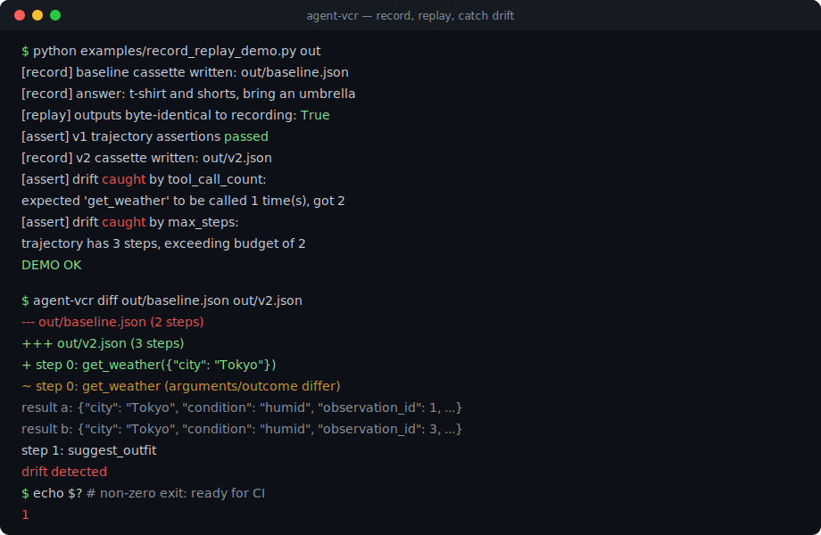
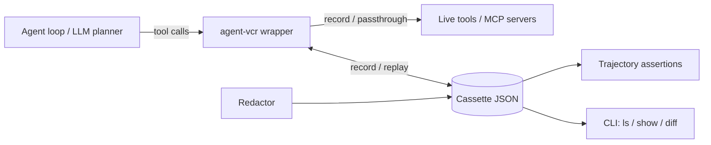

# agent-vcr

[English](README.md) | [中文](README.zh.md) | [日本語](README.ja.md)

[](LICENSE) [](CHANGELOG.md) [](pyproject.toml)  [](CONTRIBUTING.md)

**AI agent の tool calling を record-and-replay でテストするオープンソースライブラリ。環境を凍結し、CI で trajectory を検証します。**



```bash
git clone https://github.com/JaydenCJ/agent-vcr && cd agent-vcr && pip install -e .
```

> **プレリリース:** agent-vcr はまだ PyPI に公開されていません。最初のリリースまでは、[JaydenCJ/agent-vcr](https://github.com/JaydenCJ/agent-vcr) を clone してリポジトリ直下で `pip install -e .` を実行してください。

## なぜ agent-vcr なのか

現状の agent テストは、本物のツールと本物の LLM に対して毎回実行し直すことを意味します。CI のたびに費用がかかり、数分待たされ、環境の変化で不規則に落ちます。スコアリング系のプラットフォームは最終回答を採点できても、プロンプトの微修正で agent がツールを 1 回余計に呼ぶようになったことまでは教えてくれません。VCR.py は 10 年前に HTTP 層でこの問題を解決しました。agent-vcr は同じ発想を一段上の tool/MCP 境界、つまり agent の挙動が実際に決まる層に適用します。モデルは同梱せず、API も呼びません。agent は利用者側で用意し、agent-vcr はツールが返した内容を凍結する役割に徹します。

|  | agent-vcr | DeepEval | Braintrust | Langfuse | VCR.py |
|---|---|---|---|---|---|
| tool/MCP 呼び出しの記録 | Yes | No | No | Traces (view only) | No (HTTP only) |
| 環境の決定的な replay | Yes | No | No | No | Yes (HTTP layer) |
| trajectory の検証（ツール選択・引数・ステップ数） | Yes | LLM-judged metrics | LLM scorers | No | No |
| テスト実行に LLM や API key が必要 | No | Yes (judge model) | Yes (platform) | No | No |
| ランタイム依存 | 0 | 29 | SDK + SaaS | server or SaaS | 2 |

<sub>依存の数は PyPI で宣言されているランタイム依存です（2026-07 時点）。DeepEval 4.0.7 は 29 個、vcrpy 8.3.0 は 2 個（PyYAML、wrapt）。agent-vcr の数字は [pyproject.toml](pyproject.toml) の `dependencies = []` に対応します。</sub>

## 特徴

- **再実行コストゼロ** — agent のセッションを一度記録すれば、CI では永久に replay できます。token 消費もレイテンシも、不安定な実ツールの影響もありません。
- **マージ前にドリフトを検出** — ツール列・引数・呼び出し回数・ステップ数の trajectory 検証により、「プロンプト変更で agent が壊れた」を赤いテストとして可視化します。
- **コミットして安全な cassette** — API key・token・JWT は記録時にマスクされます。引数・結果だけでなくエラーメッセージも対象です。JSON はキー順が固定で、git diff がきれいに読めます。
- **pytest にそのまま統合** — `agent_vcr` fixture と環境変数 `AGENT_VCR_MODE` だけで、スイート全体を記録と厳格 replay の間で切り替えられます。cassette はテストが成功したときだけ保存されます。
- **フレームワーク非依存** — 同期・非同期の任意の callable、toolkit 全体、MCP client を duck typing でラップします。SDK 依存はなく、ランタイム依存はゼロです。結果は JSON として保存されるため、`CallToolResult` のような MCP SDK のオブジェクトは記録時も replay 時も `str()` 経由のプレーンなデータになります。公式 MCP SDK との統合テストはまだ行っていません。
- **対処しやすい失敗表示** — 厳格 replay のミスマッチ時は期待値と実際の引数 diff を出力し、`agent-vcr diff` は 2 つの cassette を比較してドリフト時に非ゼロで終了します。

## クイックスタート

インストール:

```bash
git clone https://github.com/JaydenCJ/agent-vcr && cd agent-vcr && pip install -e .
```

次の内容を `quickstart.py` として保存します:

```python
import random
from agent_vcr import with_cassette

def get_weather(city: str) -> dict:
    return {"city": city, "temp_c": random.randint(-10, 35)}

with with_cassette("weather.json") as vcr:  # run 1 records, run 2 replays
    weather = vcr.wrap_tool("get_weather", get_weather)
    print(weather("Tokyo"))
```

2 回続けて実行します。ツール自体はランダムですが、2 回目は cassette を replay するため出力が完全に一致します:

```text
$ python quickstart.py
{'city': 'Tokyo', 'temp_c': 27}
$ python quickstart.py
{'city': 'Tokyo', 'temp_c': 27}
```

記録内容の確認:

```bash
agent-vcr show weather.json
```

```text
cassette: weather
format version: 1
interactions: 1

    0. get_weather({"city": "Tokyo"})  [0.0 ms]
       -> {"city": "Tokyo", "temp_c": 27}
```

## 記録モード

| モード | 動作 |
|---|---|
| `record` | 実ツールを呼び出し、すべてのやり取りを cassette に書き込みます。wrapper は replay が返すものと同じ正規化済みの値を返すため、2 つの実行の挙動が一致します |
| `replay` | 記録済みの結果を返します。引数のドリフトは警告付きで許容します |
| `replay-strict` | 記録済みの結果を返します。一致しない呼び出しは引数 diff 付きの `CassetteMissError` になります（CI 向け） |
| `passthrough` | 実ツールを呼び出し、何も記録しません |
| `auto` | cassette があれば replay、なければ record します（デフォルト） |

pytest では `agent_vcr` fixture を受け取り、スイート全体を外側から制御できます:

```python
from agent_vcr import assert_trajectory

def test_weather_agent(agent_vcr):
    tool = agent_vcr.wrap_tool("get_weather", get_weather)
    run_my_agent(tool)
```

```bash
AGENT_VCR_MODE=record pytest          # re-record all cassettes
AGENT_VCR_MODE=replay-strict pytest   # CI: fail loudly on any drift
```

最終回答だけでなく trajectory を検証します:

```python
(assert_trajectory("cassettes/test_weather_agent.json")
    .tools_called(["get_weather", "suggest_outfit"])
    .tool_called_with("get_weather", {"city": "Tokyo"})
    .max_steps(2))
```

コマンドラインで 2 つの記録を比較できます（ドリフト時は終了コード 1 のため、そのまま CI に組み込めます）:

```bash
agent-vcr diff baseline.json v2.json
```

```text
--- baseline.json (2 steps)
+++ v2.json (3 steps)
+ step 0: get_weather({"city": "Tokyo"})
~ step 0: get_weather (arguments/outcome differ)
    result a: {"city": "Tokyo", "condition": "humid", "observation_id": 1, "temp_c": 31}
    result b: {"city": "Tokyo", "condition": "humid", "observation_id": 3, "temp_c": 31}
  step 1: suggest_outfit
drift detected
```

実行可能な天気 agent のフル例（決定的な fake LLM、2 つのツール、ドリフトのケース）は [`examples/`](examples/) に、cassette ファイル形式のドキュメントは [`docs/cassette-format.md`](docs/cassette-format.md) にあります。

## 検証

本リポジトリは CI を持たず、上記の内容はローカル実行で検証しています。本リポジトリの checkout から再現できます:

```bash
pip install -e '.[dev]' && pytest && bash scripts/smoke.sh
```

出力（実際の実行からコピー。`...` で省略）:

```text
88 passed in 0.65s
...
[diff] drift detected
SMOKE OK
```

## アーキテクチャ



## ロードマップ

- [x] record/replay エンジン、5 モード、matcher、シークレットマスク、trajectory 検証、pytest プラグイン、CLI（v0.1.0）
- [ ] 同じ cassette 形式を読む TypeScript/vitest SDK
- [ ] PyPI への公開（`pip install agent-vcr`）
- [ ] MCP proxy モード: agent コードに手を入れずプロトコル層で記録
- [ ] LangChain と OpenAI Agents SDK のツールインターフェース向けアダプター

全体は [open issues](https://github.com/JaydenCJ/agent-vcr/issues) を参照してください。

## コントリビューション

コントリビューションを歓迎します。まずは [good first issue](https://github.com/JaydenCJ/agent-vcr/issues?q=is%3Aissue+is%3Aopen+label%3A%22good+first+issue%22) から、または [Discussions](https://github.com/JaydenCJ/agent-vcr/discussions) でお気軽にどうぞ。開発環境の構築は [CONTRIBUTING.md](CONTRIBUTING.md) を参照してください。

## ライセンス

[MIT](LICENSE)
