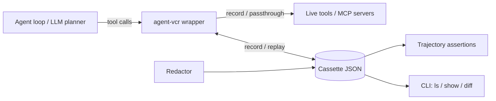

# agent-vcr

[English](README.md) | [中文](README.zh.md) | [日本語](README.ja.md)

[](LICENSE) [](CHANGELOG.md) [](pyproject.toml)  [](CONTRIBUTING.md)

**Open-source record-and-replay testing for AI agent tool calls — freeze the environment, assert the trajectory in CI.**


```bash
git clone https://github.com/JaydenCJ/agent-vcr && cd agent-vcr && pip install -e .
```

> **Pre-release:** agent-vcr is not yet published to PyPI. Until the first release, clone [JaydenCJ/agent-vcr](https://github.com/JaydenCJ/agent-vcr) and run `pip install -e .` from the repository root.

## Why agent-vcr?

Testing an agent today means re-running it against live tools and a live LLM: every CI run costs money, takes minutes, and fails randomly because the environment moved under you. Scoring platforms judge the final answer but cannot tell you that a prompt tweak silently made your agent call one extra tool. VCR.py solved this for HTTP a decade ago — agent-vcr does the same one layer up, at the tool/MCP boundary, where agent behavior actually lives. It ships no model and calls no API: you bring your own agent, agent-vcr freezes what its tools returned.

|  | agent-vcr | DeepEval | Braintrust | Langfuse | VCR.py |
|---|---|---|---|---|---|
| Records tool/MCP calls | Yes | No | No | Traces (view only) | No (HTTP only) |
| Deterministic replay of the environment | Yes | No | No | No | Yes (HTTP layer) |
| Trajectory assertions (tool choice, args, step budget) | Yes | LLM-judged metrics | LLM scorers | No | No |
| Test runs need an LLM or API key | No | Yes (judge model) | Yes (platform) | No | No |
| Runtime dependencies | 0 | 29 | SDK + SaaS | server or SaaS | 2 |

<sub>Dependency counts are the declared runtime requirements on PyPI as of 2026-07: DeepEval 4.0.7 (29), vcrpy 8.3.0 (2: PyYAML, wrapt). agent-vcr's count is `dependencies = []` in [pyproject.toml](pyproject.toml).</sub>

## Features

- **Zero-cost re-runs** — record an agent session once, replay it in CI forever: no tokens, no latency, no flaky live tools.
- **Drift caught before merge** — trajectory assertions on tool sequence, arguments, call counts, and step budget turn "the prompt change broke the agent" into a red test.
- **Safe-to-commit cassettes** — API keys, tokens, and JWTs are redacted at record time, in arguments, results, and error messages alike; JSON output has sorted keys for clean git diffs.
- **Drop-in pytest integration** — an `agent_vcr` fixture with one env var (`AGENT_VCR_MODE`) to flip a whole suite between record and strict replay; cassettes are only saved when the test passes.
- **Framework-agnostic wrapping** — wraps any sync or async callable, whole toolkits, or an MCP client by duck typing; no SDK dependency, zero runtime dependencies. Results are stored as JSON, so rich MCP SDK objects such as `CallToolResult` come back as plain data via `str()` in both record and replay — not yet integration-tested against the official MCP SDK.
- **Actionable failures** — a strict-replay miss prints an expected-vs-actual argument diff, and `agent-vcr diff` compares two cassettes with a non-zero exit on drift.

## Quickstart

Install:

```bash
git clone https://github.com/JaydenCJ/agent-vcr && cd agent-vcr && pip install -e .
```

Save this as `quickstart.py`:

```python
import random
from agent_vcr import with_cassette

def get_weather(city: str) -> dict:
    return {"city": city, "temp_c": random.randint(-10, 35)}

with with_cassette("weather.json") as vcr:  # run 1 records, run 2 replays
    weather = vcr.wrap_tool("get_weather", get_weather)
    print(weather("Tokyo"))
```

Run it twice — the tool is random, yet the second run is identical because it replays the cassette:

```text
$ python quickstart.py
{'city': 'Tokyo', 'temp_c': 27}
$ python quickstart.py
{'city': 'Tokyo', 'temp_c': 27}
```

Inspect what was recorded:

```bash
agent-vcr show weather.json
```

```text
cassette: weather
format version: 1
interactions: 1

    0. get_weather({"city": "Tokyo"})  [0.0 ms]
       -> {"city": "Tokyo", "temp_c": 27}
```

## Recording modes

| Mode | Behavior |
|---|---|
| `record` | Call live tools and write every interaction to the cassette; wrappers return the same normalized value replay will serve, so both runs behave identically |
| `replay` | Serve recorded results; tolerate argument drift with a warning |
| `replay-strict` | Serve recorded results; any unmatched call raises `CassetteMissError` with an argument diff (CI mode) |
| `passthrough` | Call live tools, record nothing |
| `auto` | Replay when the cassette exists, record otherwise (default) |

In pytest, request the `agent_vcr` fixture and control the whole suite from the outside:

```python
from agent_vcr import assert_trajectory

def test_weather_agent(agent_vcr):
    tool = agent_vcr.wrap_tool("get_weather", get_weather)
    run_my_agent(tool)
```

```bash
AGENT_VCR_MODE=record pytest          # re-record all cassettes
AGENT_VCR_MODE=replay-strict pytest   # CI: fail loudly on any drift
```

Assert the trajectory, not just the answer:

```python
(assert_trajectory("cassettes/test_weather_agent.json")
    .tools_called(["get_weather", "suggest_outfit"])
    .tool_called_with("get_weather", {"city": "Tokyo"})
    .max_steps(2))
```

Compare two recorded runs from the command line (exit code 1 on drift, so it slots into CI):

```bash
agent-vcr diff baseline.json v2.json
```

```text
--- baseline.json (2 steps)
+++ v2.json (3 steps)
+ step 0: get_weather({"city": "Tokyo"})
~ step 0: get_weather (arguments/outcome differ)
    result a: {"city": "Tokyo", "condition": "humid", "observation_id": 1, "temp_c": 31}
    result b: {"city": "Tokyo", "condition": "humid", "observation_id": 3, "temp_c": 31}
  step 1: suggest_outfit
drift detected
```

A full runnable weather-agent example (deterministic fake LLM, two tools, drift case) lives in [`examples/`](examples/), and the cassette file format is documented in [`docs/cassette-format.md`](docs/cassette-format.md).

## Verification

This repository ships no CI; every claim above is verified by local runs. Reproduce them from a checkout of this repository:

```bash
pip install -e '.[dev]' && pytest && bash scripts/smoke.sh
```

Output (copied from a real run, truncated with `...`):

```text
88 passed in 0.65s
...
[diff] drift detected
SMOKE OK
```

## Architecture



## Roadmap

- [x] Record/replay engine, five modes, matchers, redaction, trajectory assertions, pytest plugin, CLI (v0.1.0)
- [ ] TypeScript/vitest SDK reading the same cassette format
- [ ] PyPI release with `pip install agent-vcr`
- [ ] MCP proxy mode: record at the protocol layer without touching agent code
- [ ] Adapters for LangChain and OpenAI Agents SDK tool interfaces

See the [open issues](https://github.com/JaydenCJ/agent-vcr/issues) for the full list.

## Contributing

Contributions are welcome — start with a [good first issue](https://github.com/JaydenCJ/agent-vcr/issues?q=is%3Aissue+is%3Aopen+label%3A%22good+first+issue%22) or open a [discussion](https://github.com/JaydenCJ/agent-vcr/discussions). See [CONTRIBUTING.md](CONTRIBUTING.md) for the development setup.

## License

[MIT](LICENSE)
