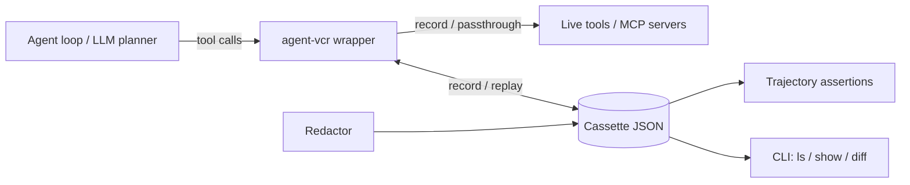

# agent-vcr

[English](README.md) | [中文](README.zh.md) | [日本語](README.ja.md)

[](LICENSE) [](CHANGELOG.md) [](pyproject.toml)  [](CONTRIBUTING.md)

**开源的 AI agent 工具调用 record-and-replay 测试库——冻结环境，在 CI 中断言 trajectory。**


```bash
git clone https://github.com/JaydenCJ/agent-vcr && cd agent-vcr && pip install -e .
```

> **预发布：** agent-vcr 尚未发布到 PyPI。首个版本发布前，请克隆 [JaydenCJ/agent-vcr](https://github.com/JaydenCJ/agent-vcr) 并在仓库根目录执行 `pip install -e .`。

## 为什么是 agent-vcr？

今天测试一个 agent 意味着对着真实工具和真实 LLM 反复重跑：每次 CI 都在烧钱、耗时数分钟，还会因为环境变化而随机挂掉。打分类平台只评判最终答案，却无法告诉你一次提示词微调让 agent 悄悄多调了一次工具。VCR.py 十年前在 HTTP 层解决了这个问题——agent-vcr 把同样的思路上移一层，放到 tool/MCP 边界，也就是 agent 行为真正发生的地方。它不带任何模型、不调用任何 API：agent 由你自己提供，agent-vcr 负责冻结工具返回过什么。

|  | agent-vcr | DeepEval | Braintrust | Langfuse | VCR.py |
|---|---|---|---|---|---|
| 录制 tool/MCP 调用 | Yes | No | No | Traces (view only) | No (HTTP only) |
| 环境的确定性回放 | Yes | No | No | No | Yes (HTTP layer) |
| Trajectory 断言（工具选择、参数、步数预算） | Yes | LLM-judged metrics | LLM scorers | No | No |
| 跑测试需要 LLM 或 API key | No | Yes (judge model) | Yes (platform) | No | No |
| 运行时依赖 | 0 | 29 | SDK + SaaS | server or SaaS | 2 |

<sub>依赖数量为 PyPI 上声明的运行时依赖（2026-07 查证）：DeepEval 4.0.7 为 29 个，vcrpy 8.3.0 为 2 个（PyYAML、wrapt）。agent-vcr 的数字对应 [pyproject.toml](pyproject.toml) 中的 `dependencies = []`。</sub>

## 特性

- **重跑零成本** —— agent 会话录一次，CI 里永久回放：不花 token、无延迟、不受不稳定的真实工具影响。
- **合并前抓住漂移** —— 对工具序列、参数、调用次数、步数预算做 trajectory 断言，把"改了提示词把 agent 改坏了"变成一条红色测试。
- **cassette 可安心提交** —— API key、token、JWT 在录制时即被脱敏，参数、结果与错误信息一视同仁；JSON 输出键序固定，git diff 干净。
- **pytest 开箱即用** —— `agent_vcr` fixture 配合一个环境变量（`AGENT_VCR_MODE`），整个测试套件在录制与严格回放之间一键切换；cassette 仅在测试通过时保存。
- **不绑定任何框架** —— 通过鸭子类型包装任意同步/异步可调用对象、整个 toolkit 或 MCP client；不依赖 SDK，运行时零依赖。结果以 JSON 形式存储，因此 MCP SDK 的复杂对象（如 `CallToolResult`）在录制与回放中都会经 `str()` 降级为普通数据——尚未与官方 MCP SDK 做过集成联调。
- **失败信息可操作** —— 严格回放未命中时打印期望与实际的参数 diff；`agent-vcr diff` 比较两份 cassette，漂移时以非零退出码返回。

## 快速开始

安装：

```bash
git clone https://github.com/JaydenCJ/agent-vcr && cd agent-vcr && pip install -e .
```

将以下内容保存为 `quickstart.py`：

```python
import random
from agent_vcr import with_cassette

def get_weather(city: str) -> dict:
    return {"city": city, "temp_c": random.randint(-10, 35)}

with with_cassette("weather.json") as vcr:  # run 1 records, run 2 replays
    weather = vcr.wrap_tool("get_weather", get_weather)
    print(weather("Tokyo"))
```

连续运行两次——工具本身是随机的，但第二次输出完全一致，因为它回放的是 cassette：

```text
$ python quickstart.py
{'city': 'Tokyo', 'temp_c': 27}
$ python quickstart.py
{'city': 'Tokyo', 'temp_c': 27}
```

查看录制内容：

```bash
agent-vcr show weather.json
```

```text
cassette: weather
format version: 1
interactions: 1

    0. get_weather({"city": "Tokyo"})  [0.0 ms]
       -> {"city": "Tokyo", "temp_c": 27}
```

## 录制模式

| 模式 | 行为 |
|---|---|
| `record` | 调用真实工具，把每次交互写入 cassette；wrapper 返回与回放时完全相同的归一化值，两种运行行为一致 |
| `replay` | 返回录制结果；参数漂移时容忍并给出警告 |
| `replay-strict` | 返回录制结果；任何未命中的调用抛出带参数 diff 的 `CassetteMissError`（CI 模式） |
| `passthrough` | 调用真实工具，不做任何录制 |
| `auto` | cassette 存在则回放，否则录制（默认） |

在 pytest 中请求 `agent_vcr` fixture，从外部控制整个套件：

```python
from agent_vcr import assert_trajectory

def test_weather_agent(agent_vcr):
    tool = agent_vcr.wrap_tool("get_weather", get_weather)
    run_my_agent(tool)
```

```bash
AGENT_VCR_MODE=record pytest          # re-record all cassettes
AGENT_VCR_MODE=replay-strict pytest   # CI: fail loudly on any drift
```

断言 trajectory，而不只是最终答案：

```python
(assert_trajectory("cassettes/test_weather_agent.json")
    .tools_called(["get_weather", "suggest_outfit"])
    .tool_called_with("get_weather", {"city": "Tokyo"})
    .max_steps(2))
```

在命令行比较两次录制（漂移时退出码为 1，可直接接入 CI）：

```bash
agent-vcr diff baseline.json v2.json
```

```text
--- baseline.json (2 steps)
+++ v2.json (3 steps)
+ step 0: get_weather({"city": "Tokyo"})
~ step 0: get_weather (arguments/outcome differ)
    result a: {"city": "Tokyo", "condition": "humid", "observation_id": 1, "temp_c": 31}
    result b: {"city": "Tokyo", "condition": "humid", "observation_id": 3, "temp_c": 31}
  step 1: suggest_outfit
drift detected
```

完整可运行的天气 agent 示例（确定性假 LLM、两个工具、漂移案例）见 [`examples/`](examples/)；cassette 文件格式文档见 [`docs/cassette-format.md`](docs/cassette-format.md)。

## 验证

本仓库不设 CI；以上说明均以本地实跑验证。克隆本仓库即可复现：

```bash
pip install -e '.[dev]' && pytest && bash scripts/smoke.sh
```

输出（拷贝自一次真实运行，用 `...` 截断）：

```text
88 passed in 0.65s
...
[diff] drift detected
SMOKE OK
```

## 架构



## 路线图

- [x] 录制/回放引擎、五种模式、matcher、脱敏、trajectory 断言、pytest 插件、CLI（v0.1.0）
- [ ] 读取同一 cassette 格式的 TypeScript/vitest SDK
- [ ] 发布到 PyPI，支持 `pip install agent-vcr`
- [ ] MCP proxy 模式：在协议层录制，无需改动 agent 代码
- [ ] LangChain 与 OpenAI Agents SDK 工具接口适配器

完整列表见 [open issues](https://github.com/JaydenCJ/agent-vcr/issues)。

## 参与贡献

欢迎贡献——从 [good first issue](https://github.com/JaydenCJ/agent-vcr/issues?q=is%3Aissue+is%3Aopen+label%3A%22good+first+issue%22) 入手，或到 [Discussions](https://github.com/JaydenCJ/agent-vcr/discussions) 发起讨论。开发环境搭建见 [CONTRIBUTING.md](CONTRIBUTING.md)。

## 许可证

[MIT](LICENSE)
